# Репозиторій для практичних робіт з M1.OpenGL.
## Системна Інформація
- Processor	AMD Ryzen 5 5600 6-Core Processor 3.50 GHz
- RAM	32.0 GB (31.9 GB usable)
- System type	64-bit operating system, x64-based processor
- Edition	Windows 11 Home Version 23H2
- IDE	Microsoft Visual Studio Enterprise 2022 (64-bit) version 17.11.4
## Практична робота №1. Основні принципи роботи з OpenGL
### Мета роботи

За допомогою інструментальних засобів, зазначених викладачем, створити простий програмний проєкт із підтримкою бібліотеки OpenGL. Розробити програму із застосуванням команд OpenGL, яка встановлює анізотропну систему координат, створює та виводить варіант зображення на екран/у вікно з урахуванням заданих примітивів та координат x1, y1 та x2, y2 . Для рисування координатної сітки необхідно використовувати пунктирні лінії. Контур фігури, осі та координатну сітку зобразити лініями різної товщини. Для парних варіантів точки повинні мати квадратну форму, а для непарних – круглу

### Виконання роботи
Для управління параметрами графічних примітивів було використано наступні команди:
̶	колір, glColor3ub() рядок 19 у файлі FirstTasks.cs;
̶	тип, glLineStipple(), glEnable()/glDisable(), рядок 17 у файлі FirstTasks.cs;
̶	товщина glLineWidth(), рядок 45 у файлі FirstTasks.cs
Коректне відображення завдання під час змінення розмірів/положення вікна наведено у рис. 1.1 та 1.2
Розроблення підпрограм для виключення дублювання коду наведено у рядках 34 – 59 файлу FirstTasks.cs
Застосування циклів для створення зображень наведено у рядках 21 – 30 файлу FirstTasks.cs.
Використання ООП реалізовано за допомогою розроблення власних класів, які наведено у файлах Figure.cs.

Рисунок 1.1 – Тестування програми при зміні ширини вікна

Рисунок 1.2 – Тестування програми при зміні висоти вікна

### Контроль виконання вимог та елементів завдання
<table>
  <tr>
    <th>№ з/п</th>
    <th>Складність</th>
    <th>Вимоги</th>
    <th>Бали</th>
    <th>Зроблено</th>
  </tr>
  <tr>
    <td>1</td>
    <td rowspan="4">Базовий рівень</td>
    <td>Використання команд управління параметрами графічних примітивів (колір, тип, товщина)</td>
    <td>2</td>
    <td>+</td>
  </tr>
  <tr>
    <td>2</td>
    <td>Коректне відображення завдання під час змінення розмірів/положення вікна</td>
    <td>1</td>
    <td>+</td>
  </tr>
  <tr>
    <td>3</td>
    <td>Розроблення підпрограм для виключення дублювання коду</td>
    <td>1</td>
    <td>+</td>
  </tr>
  <tr>
    <td>4</td>
    <td>Застосування циклів для створення зображень</td>
    <td>1</td>
    <td>+</td>
  </tr>
  <tr>
    <td>5</td>
    <td rowspan="2">Підвищений рівень</td>
    <td>Формування зображення векторними командами OpenGL (glDrawArrays і т. п.)</td>
    <td>1</td>
    <td>-</td>
  </tr>
  <tr>
    <td>6</td>
    <td>Використання ООП (розроблення власних класів)</td>
    <td>2</td>
    <td>+</td>
  </tr>
</table>

## Практична робота №2. Графічні примітиви OpenGL
### Мета роботи

Вивчити поняття теселяції і навчитися використовувати графічні примітиви OpenGL для створення поверхонь. Освоїти обробку подій клавіатури і маніпулятора «миша» для створення інтерактивних застосунків.

### Виконання роботи
У даній практичній роботі було розроблено застосунок з використанням бібліотеки OpenGL для відображення правильного багатокутника та можливості замощення області екрану користувачем. Програма реалізована з використанням команд OpenGL для керування примітивами, налаштування координатної системи, відображення фігур та взаємодії з користувачем.
Налаштування координатної системи: 
Використовуються функції glOrtho() та glViewport() для встановлення ізотропної системи координат, що дозволяє відображати багатокутники в центрі вікна незалежно від розмірів області рендерингу. Параметри масштабування визначаються розмірами фігури та кількістю плиток, які буде відображено на екрані.
Коректне відображення завдання під час змінення розмірів/положення вікна наведено у рис. 2.1 та 2.2
Відображення багатокутника: 
Для відображення правильного багатокутника використано примітиви GL_TRIANGLE_STRIP та GL_POLYGON. Після старту програми у робочій області відображається одна плитка. Розмір плитки визначено згідно з варіантом, де сторона фігури дорівнює 50.
Реалізовано три режими відображення фігур:
•	Точковий режим (відображення лише вершин фігури) за допомогою примітиву GL_POINTS.
•	Контурний режим (відображення лише контуру фігури) за допомогою примітиву GL_LINE_LOOP.
•	Режим із заливкою (заповнення кольором) за допомогою примітиву GL_TRIANGLE_STRIP та GL_POLYGON.
Колірна схема: 
Для зафарбування фігур використано шість кольорів: білий, сірий (35%), червоний, зелений, синій та жовтий. Фарба накладається відповідно до положення багатокутників на екрані.

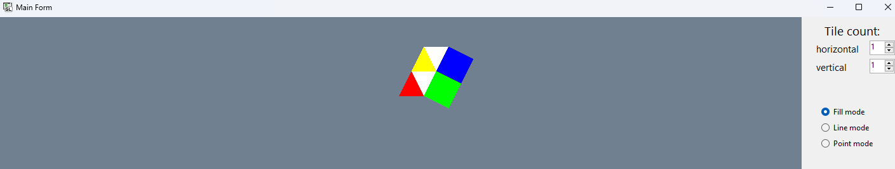

Рисунок 2.1 – Тестування програми при зміні ширини вікна

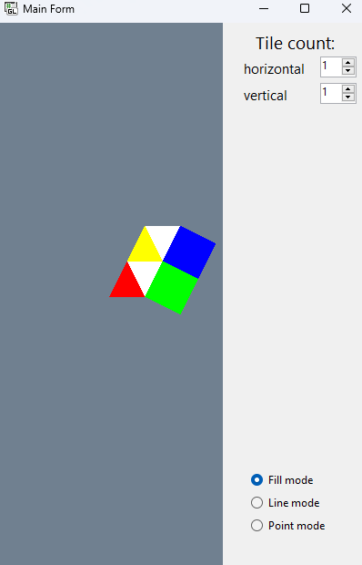

Рисунок 2.2 – Тестування програми при зміні висоти вікна

### Контроль виконання вимог та елементів завдання
<table>
  <tr>
    <th>№ з/п</th>
    <th>Складність</th>
    <th>Вимоги</th>
    <th>Бали</th>
    <th>Зроблено</th>
  </tr>
  <tr>
    <td>1</td>
    <td rowspan="6">Базовий рівень</td>
    <td>Під час запуску застосунку зображення відповідає варіанту завдання з однією плиткою</td>
    <td>1</td>
    <td>+</td>
  </tr>
  <tr>
    <td>2</td>
    <td>Багаторазове замощення плиткою. Кратність замощення задається користувачем під час роботи застосунку</td>
    <td>1</td>
    <td>+</td>
  </tr>
  <tr>
    <td>3</td>
    <td>Коректне відображення завдання під час зміни як розмірів/положення вікна, так і параметрів замощення.</td>
    <td>1</td>
    <td>+</td>
  </tr>
  <tr>
    <td>4</td>
    <td>Організація взаємодії з користувачем одним зі стандартних засобів (клавіатура, «миша» та ін.)</td>
    <td>1</td>
    <td>+</td>
  </tr>
  <tr>
  <tr>
    <td>5</td>
    <td>Застосування мінімальної (у рамках варіанту) кількості графічних примітивів для виконання завдання</td>
    <td>1</td>
    <td>+</td>
  </tr>
  <tr>
    <td>6</td>
    <td rowspan="2">Підвищений рівень</td>
    <td>Створення власних елементів інтерфейсу за допомогою OpenGL</td>
    <td>2</td>
    <td>+</td>
  </tr>
  <tr>
    <td>7</td>
    <td>Використання ООП (розроблення власних класів)</td>
    <td>1</td>
    <td>+</td>
  </tr>
</table>

## Практична робота №3. Графік функції однієї змінної
### Мета роботи

Вивчити основні поняття і принципи перетворення координат для побудови двомірного графіка.

### Виконання роботи
Для реалізації завдання було розроблено програму, що будує графік функцій f_1 (x) та f_2 (x) на заданому інтервалі з можливістю масштабування і ручного налаштування осей. Зокрема, програма:
- Дозволяє користувачу задавати інтервал для осі 𝑋 і автоматично масштабує вісь 𝑌.
- Відображає осі координат, точки перетину функції з віссю абсцис та координатну сітку.
- Коректно відображає функцію f_2 (x) з урахуванням ліній розриву.

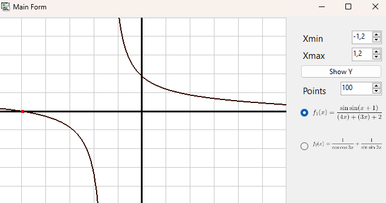

Рисунок 3.1 – Тестування роботи програми

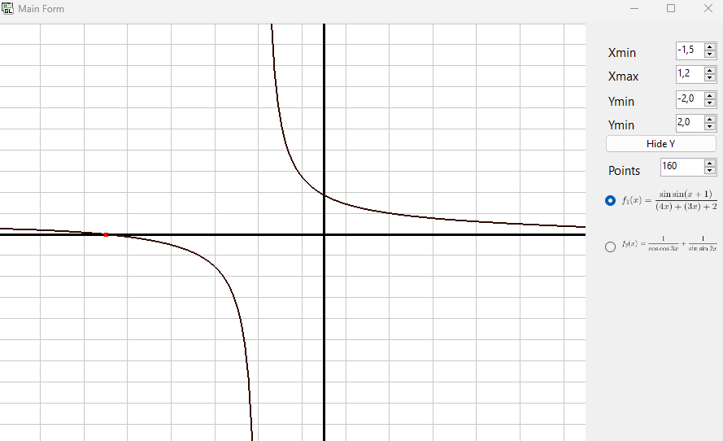

Рисунок 3.2 – Тестування роботи програми при зміні параметрів і розміру

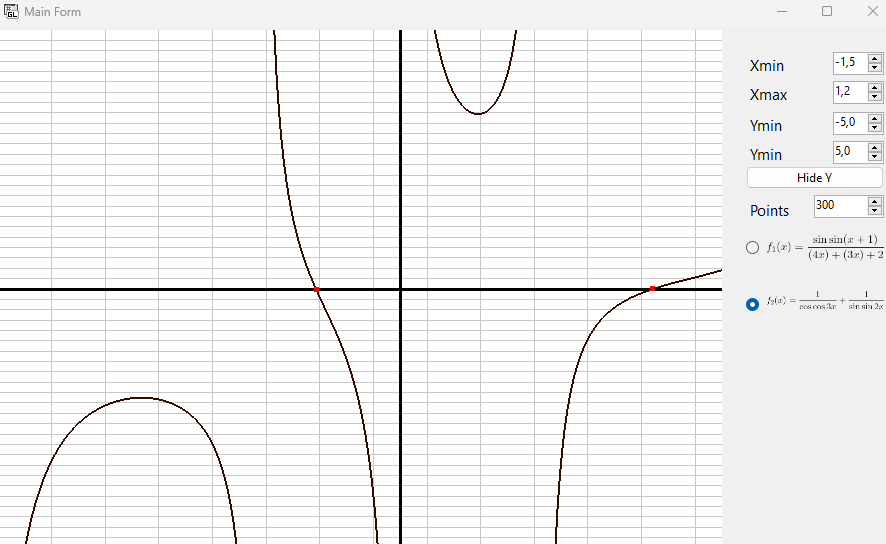

Рисунок 3.3 – Тестування роботи програми при зміні параметрів, функції і розміру вікна

### Контроль виконання вимог та елементів завдання
<table>
  <tr>
    <th>№ з/п</th>
    <th>Складність</th>
    <th>Вимоги</th>
    <th>Бали</th>
    <th>Зроблено</th>
  </tr>
  <tr>
    <td>1</td>
    <td rowspan="3">Базовий рівень</td>
    <td>Осі координат і графік функції f1(x) виводяться на заданому користувачем інтервалі від Xmin до Xmax і від Ymin до Ymax</td>
    <td>1</td>
    <td>+</td>
  </tr>
  <tr>
    <td>2</td>
    <td>Автоматичні обчислення Ymin і Ymax на завданому інтервалі від Xmin до Xmax функції f1(x)</td>
    <td>2</td>
    <td>+</td>
  </tr>
  <tr>
    <td>3</td>
    <td>Обчислення і виведення на екран точок f1(x)=0</td>
    <td>2</td>
    <td>+</td>
  </tr>
  <tr>
    <td>4</td>
    <td rowspan="2">Підвищений рівень</td>
    <td>Коректне виведення графіка f2(x) (без хибного виводу точок розриву як точок перетину з віссю абсцис) і з відображенням ліній розриву функції</td>
    <td>2</td>
    <td>+</td>
  </tr>
  <tr>
    <td>5</td>
    <td>Використання ООП (наслідування, використання віртуальних і абстрактних методів)</td>
    <td>1</td>
    <td>+</td>
  </tr>
</table>

## Практична робота №4. Криві другого порядку
### Мета роботи

Вивчити оматематичні методи та засоби для реалізації графічних примітивів.

### Виконання роботи
Для реалізації завдання було розроблено програму, що малює еліпс або параболу на заданому інтервалі з можливістю вказання точок, що формують відрізок, в області графічного виведення програми за допомогою маніпулятора «миш».

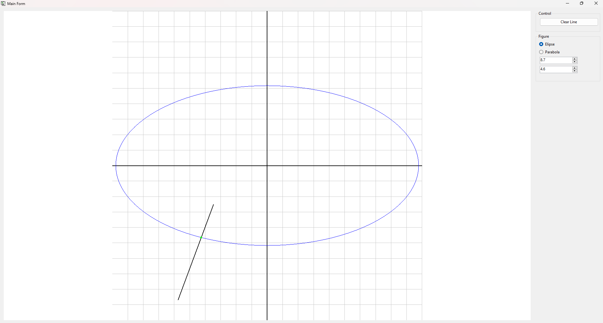

Рисунок 4.1 – Тестування роботи програми коли в нас еліпс та ширина більше за висоту

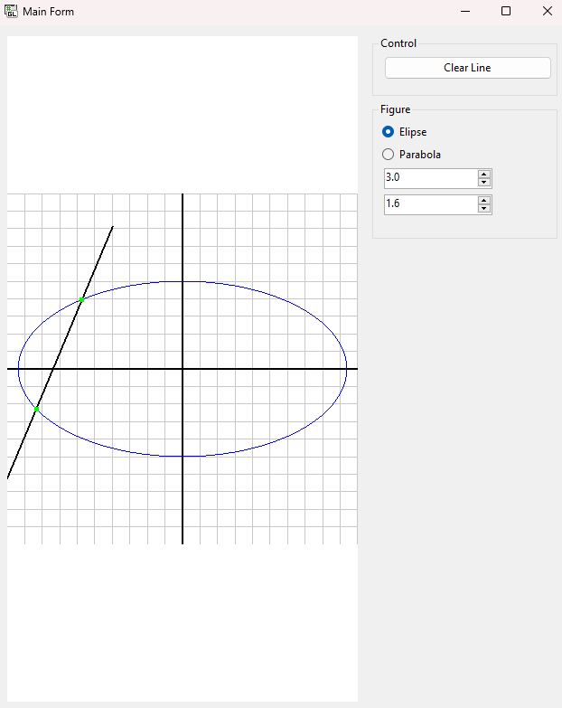

Рисунок 4.2 – Тестування роботи програми коли в нас еліпс та висота більше за ширину

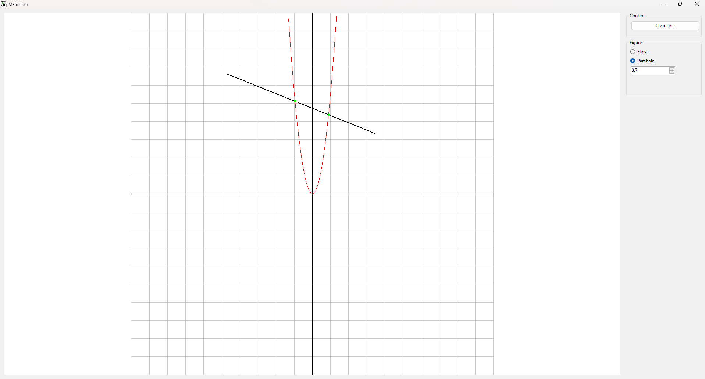

Рисунок 4.3 – Тестування роботи програми коли в нас парабола та ширина більше за висоту

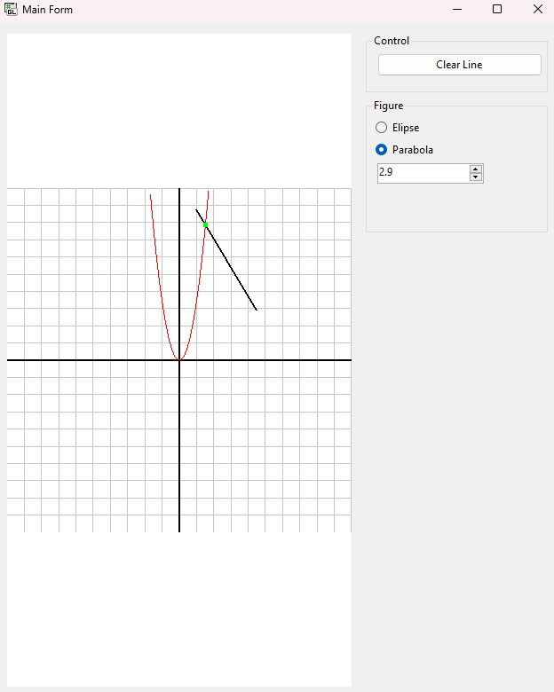

Рисунок 4.4 – Тестування роботи програми коли в нас парабола та висота більше за ширину

### Контроль виконання вимог та елементів завдання
<table>
  <tr>
    <th>№ з/п</th>
    <th>Складність</th>
    <th>Вимоги</th>
    <th>Бали</th>
    <th>Зроблено</th>
  </tr>
  <tr>
    <td>1</td>
    <td rowspan="3">Базовий рівень</td>
    <td>Установлення ізотропної системи координат для вікна з змінюваними розмірами</td>
    <td>1</td>
    <td>+</td>
  </tr>
  <tr>
    <td>2</td>
    <td>Виведення кривих другого порядку відповідно до варіанту завдання</td>
    <td>2</td>
    <td>+</td>
  </tr>
  <tr>
    <td>3</td>
    <td>Виведення відрізка та обчислення його точок перетину з кривою другого порядку відповідно до варіанту</td>
    <td>2</td>
    <td>+</td>
  </tr>
  <tr>
    <td>4</td>
    <td rowspan="2">Підвищений рівень</td>
    <td>Вказання положення точок, що формують відрізок, в області графічного виведення програми за допомогою маніпулятора «миш»</td>
    <td>2</td>
    <td>+</td>
  </tr>
  <tr>
    <td>5</td>
    <td>Використання ООП</td>
    <td>1</td>
    <td>+</td>
  </tr>
</table>

## Практична робота №5. Афінні перетворення у просторі
### Мета роботи

навчитися працювати з тривимірними графічними примітивами OpenGL та застосовувати афінні перетворення для розміщення об’єктів у просторі.

### Виконання роботи
Для реалізації завдання було розроблено програму, має дві системи відображення трьох вимірного простору, де є сітка та лінії для показу осей. Також в просторі знаходяться три фігури по завданню, з можливістю вмикання/вимикання освітлення.

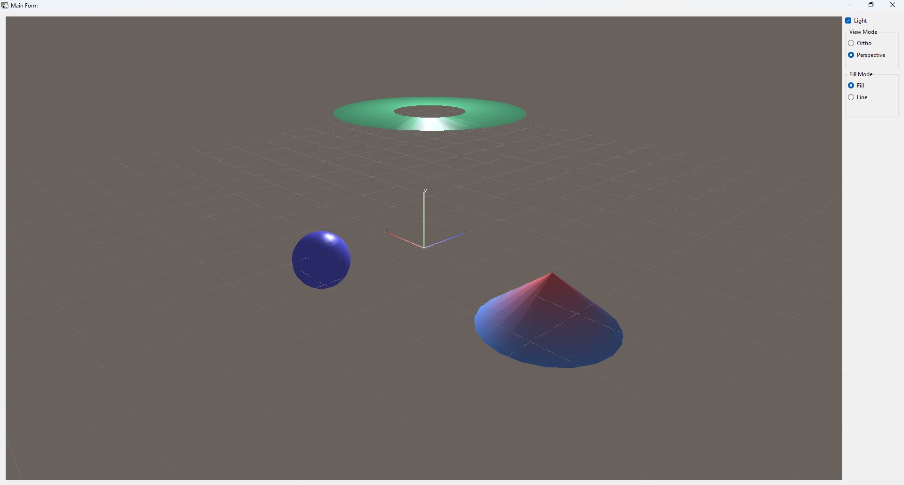

Рисунок 5.1 – Тестування роботи програми в ортогональному відображенні

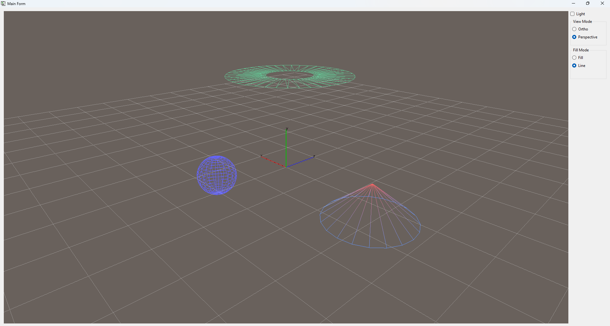

Рисунок 5.2 – ТТестування роботи програми в ортогональному відображенні

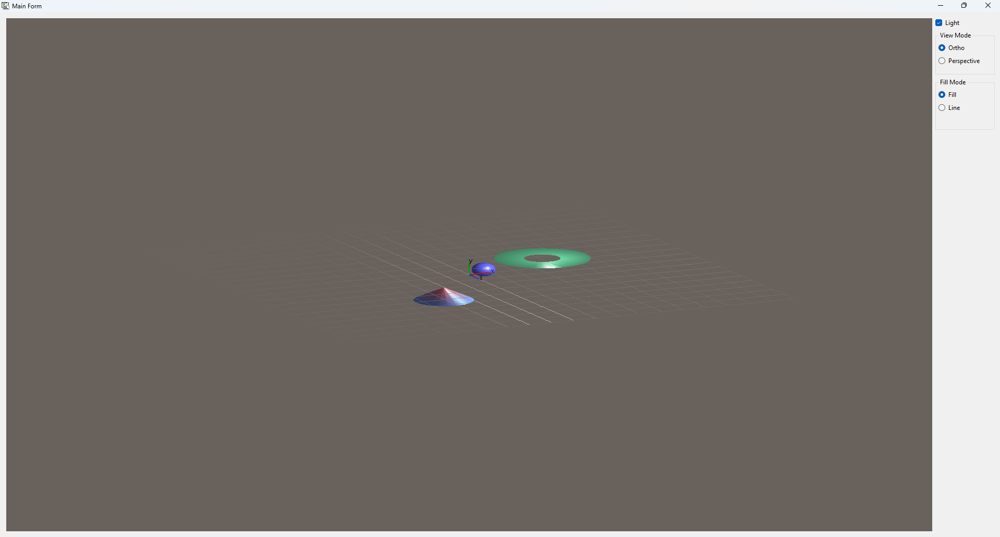

Рисунок 5.3 – Тестування роботи програми в перспективному відображенні

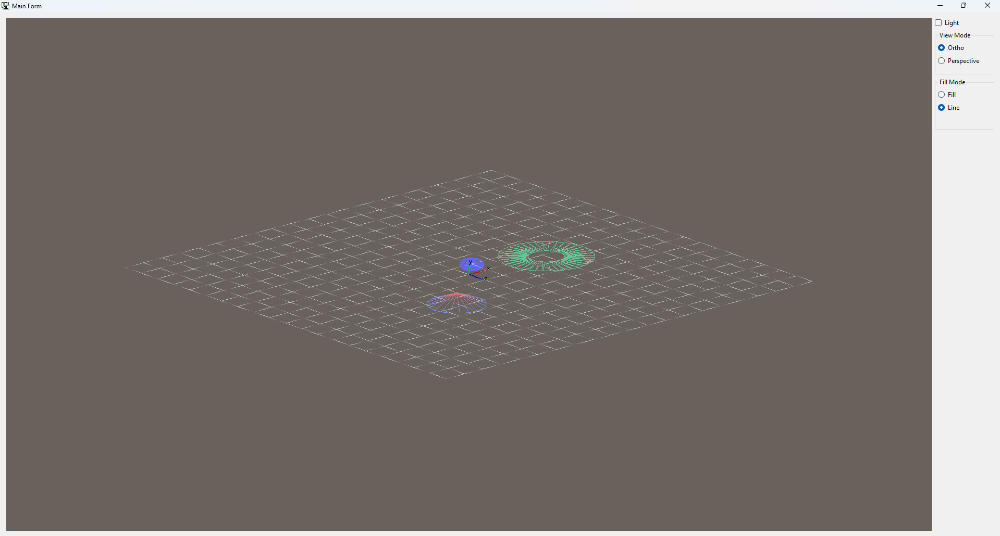

Рисунок 5.4 – Тестування роботи програми в перспективному відображенні

### Контроль виконання вимог та елементів завдання
<table>
  <tr>
    <th>№ з/п</th>
    <th>Складність</th>
    <th>Вимоги</th>
    <th>Бали</th>
    <th>Зроблено</th>
  </tr>
  <tr>
    <td>1</td>
    <td rowspan="5">Базовий рівень</td>
    <td>Коректне (ізотропне) відображення завдання (під час зміни розмірів вікна) у ортографічній проекції</td>
    <td>1</td>
    <td>+</td>
  </tr>
  <tr>
    <td>2</td>
    <td>Під час запуску застосунку відображаються осі 0X, 0Y, 0Z, координатна сітка і каркас квадратичних об’єктів</td>
    <td>1</td>
    <td>+</td>
  </tr>
    <tr>
    <td>3</td>
    <td>Інтерфейс керування параметрами площини відтину</td>
    <td>1</td>
    <td>+</td>
  </tr>
    <tr>
    <td>4</td>
    <td>Використання джерел світла для освітлення об’єктів сцени сумісно з командою glColorMaterial</td>
    <td>1</td>
    <td>+</td>
  </tr>
  <tr>
    <td>5</td>
    <td>Використання списків відображення (Display Lists)</td>
    <td>1</td>
    <td>+</td>
  </tr>
  <tr>
    <td>6</td>
    <td rowspan="3">Підвищений рівень</td>
    <td>Створення зображення сцени в перспективній проекції</td>
    <td>1</td>
    <td>+</td>
  </tr>
  <tr>
    <td>7</td>
    <td>Накладення текстури на поверхню завданих у варіанті фігур</td>
    <td>1</td>
    <td>+</td>
  </tr>
    <tr>
    <td>8</td>
    <td>Застосування команди glMaterial для налаштування параметрів відбиття поверхонь об’єктів сцени</td>
    <td>1</td>
    <td>+</td>
  </tr>
</table>

## Практична робота №6. Візуалізація прямої задачі кінематики
### Мета роботи

Використовуючи інструментальні засоби, запропоновані викладачем, створити додаток для виведення на екран моделі маніпулятора за даною кінематичною схемою. Для управління моделлю та точкою спостереження необхідно використовувати клавіатуру та/або маніпулятор «миша», за допомогою яких змінюють значення параметрів, які відповідають руху, наприклад кути ϕ , θ , ψ , відстань S.

### Виконання роботи
У результаті виконання розробленого додатка на екран виведено маніпулятор, що відповідає заданій кінематичній схемі.

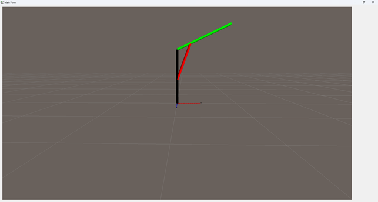

Рисунок 6.1 – Тестування роботи програми, фігура без змін

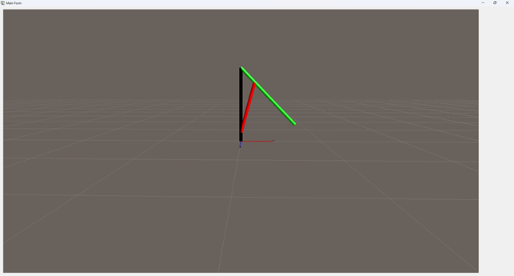

Рисунок 6.2 – Тестування роботи програми, точка переміщена нижче

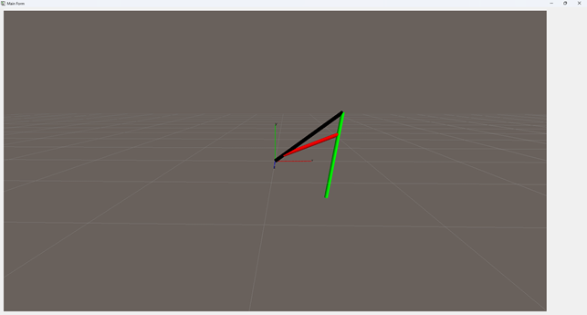

Рисунок 6.3 – Тестування роботи програми, точка переміщена нижче та фігура трохи нахилена

### Контроль виконання вимог та елементів завдання
<table>
  <tr>
    <th>№ з/п</th>
    <th>Складність</th>
    <th>Вимоги</th>
    <th>Бали</th>
    <th>Зроблено</th>
  </tr>
  <tr>
    <td>1</td>
    <td rowspan="6">Базовий рівень</td>
    <td>Реалізація програми двовимірної моделі маніпулятора відповідно до варіанта</td>
    <td>5</td>
    <td>+</td>
  </tr>
  <tr>
    <td>2</td>
    <td>Доопрацювання програми до тривимірної моделі (обертання точки спостереження, масштаб)</td>
    <td>1</td>
    <td>+</td>
  </tr>
  <tr>
    <td>3</td>
    <td>Управління моделлю та точкою спостереження маніпулятором «миша» та/або клавіатурою</td>
    <td>1</td>
    <td>+</td>
  </tr>
  <tr>
    <td>4</td>
    <td>Використання квадратичних примітивів для відображення кінематичної схеми</td>
    <td>3</td>
    <td>+</td>
  </tr>
  <tr>
    <td>5</td>
    <td>Використання освітлення та визначення матеріалів командою glColorMaterial (...)</td>
    <td>4</td>
    <td>+</td>
  </tr>
  <tr>
    <td>6</td>
    <td>Вміст звіту відповідає прикладу оформлення</td>
    <td>6</td>
    <td>+</td>
  </tr>
  <tr>
    <td>7</td>
    <td rowspan="4">Підвищений рівень</td>
    <td>Використання ООП (розробка власних класів)</td>
    <td>1</td>
    <td>+</td>
  </tr>
  <tr>
    <td>8</td>
    <td>Використання текстур для елементів кінематичної схеми</td>
    <td>2</td>
    <td></td>
  </tr>
  <tr>
    <td>9</td>
    <td>Визначення матеріалів командою glMaterial (...), використання прозорості</td>
    <td>2</td>
    <td>+</td>
  </tr>
  <tr>
    <td>10</td>
    <td>Використання перспективної проекції для відображення моделі маніпулятора</td>
    <td>1</td>
    <td>+</td>
  </tr>
  <tr>
    <td>11</td>
    <td>Реалізація освітлення з тінню від моделі маніпулятора</td>
    <td>4</td>
    <td></td>
  </tr>
</table>
