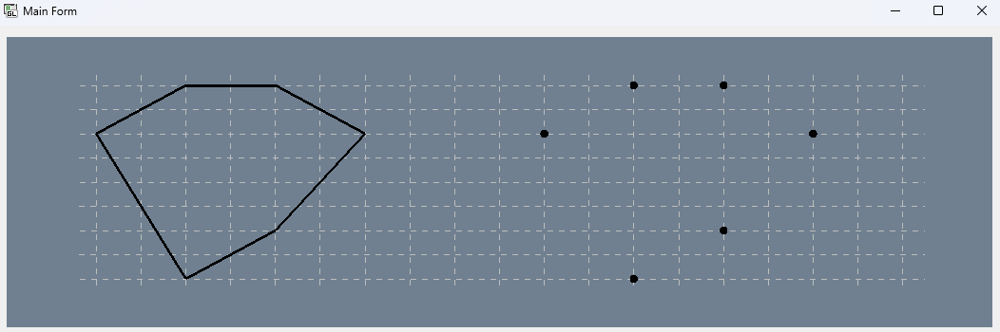
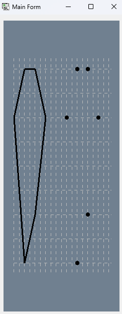

# Репозиторій для практичних робіт з M1.OpenGL.
## Системна Інформація
- Processor	AMD Ryzen 5 5600 6-Core Processor 3.50 GHz
- RAM	32.0 GB (31.9 GB usable)
- System type	64-bit operating system, x64-based processor
- Edition	Windows 11 Home Version 23H2
- IDE	Microsoft Visual Studio Enterprise 2022 (64-bit) version 17.11.4
## Практична робота №1. Основні принципи роботи з OpenGL
### Мета роботи

За допомогою інструментальних засобів, зазначених викладачем, створити простий програмний проєкт із підтримкою бібліотеки OpenGL. Розробити програму із застосуванням команд OpenGL, яка встановлює анізотропну систему координат, створює та виводить варіант зображення на екран/у вікно з урахуванням заданих примітивів та координат x1, y1 та x2, y2 . Для рисування координатної сітки необхідно використовувати пунктирні лінії. Контур фігури, осі та координатну сітку зобразити лініями різної товщини. Для парних варіантів точки повинні мати квадратну форму, а для непарних – круглу

### Виконання роботи
Для управління параметрами графічних примітивів було використано наступні команди:
̶	колір, glColor3ub() рядок 19 у файлі FirstTasks.cs;
̶	тип, glLineStipple(), glEnable()/glDisable(), рядок 17 у файлі FirstTasks.cs;
̶	товщина glLineWidth(), рядок 45 у файлі FirstTasks.cs
Коректне відображення завдання під час змінення розмірів/положення вікна наведено у рис. 1.1 та 1.2
Розроблення підпрограм для виключення дублювання коду наведено у рядках 34 – 59 файлу FirstTasks.cs
Застосування циклів для створення зображень наведено у рядках 21 – 30 файлу FirstTasks.cs.
Використання ООП реалізовано за допомогою розроблення власних класів, які наведено у файлах Figure.cs.

Рисунок 1.1 – Тестування програми при зміні ширини вікна

Рисунок 1.2 – Тестування програми при зміні висоти вікна

### Контроль виконання вимог та елементів завдання
<table>
  <tr>
    <th>№ з/п</th>
    <th>Складність</th>
    <th>Вимоги</th>
    <th>Бали</th>
    <th>Зроблено</th>
  </tr>
  <tr>
    <td>1</td>
    <td rowspan="4">Базовий рівень</td>
    <td>Використання команд управління параметрами графічних примітивів (колір, тип, товщина)</td>
    <td>2</td>
    <td>+</td>
  </tr>
  <tr>
    <td>2</td>
    <td>Коректне відображення завдання під час змінення розмірів/положення вікна</td>
    <td>1</td>
    <td>+</td>
  </tr>
  <tr>
    <td>3</td>
    <td>Розроблення підпрограм для виключення дублювання коду</td>
    <td>1</td>
    <td>+</td>
  </tr>
  <tr>
    <td>4</td>
    <td>Застосування циклів для створення зображень</td>
    <td>1</td>
    <td>+</td>
  </tr>
  <tr>
    <td>5</td>
    <td rowspan="2">Підвищений рівень</td>
    <td>Формування зображення векторними командами OpenGL (glDrawArrays і т. п.)</td>
    <td>1</td>
    <td>-</td>
  </tr>
  <tr>
    <td>6</td>
    <td>Використання ООП (розроблення власних класів)</td>
    <td>2</td>
    <td>+</td>
  </tr>
</table>
